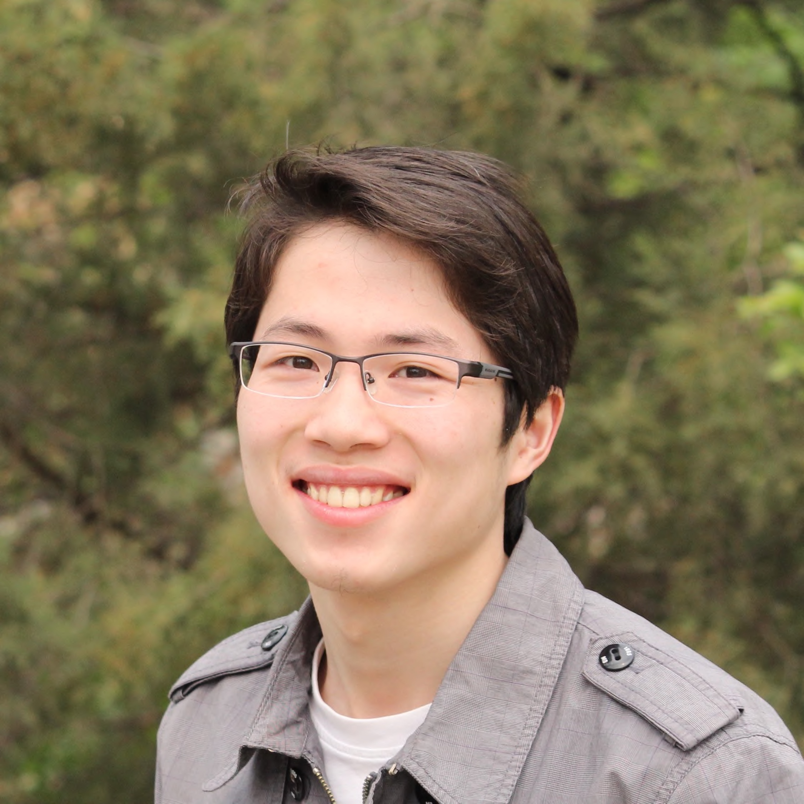

---
hide:
    - navigation
---

# **AI4EPS: Artificial Intelligence (AI) for Earth and Planetary Science (EPS)**

### Weiqiang Zhu 

[Assistant Professor](https://eps.berkeley.edu/people/weiqiang-zhu) ([CV](cv.pdf))

[Earth & Planetary Science](https://www.eps.berkeley.edu), [University of California, Berkeley](https://www.berkeley.edu)

[Berkeley Seismology Lab](https://seismo.berkeley.edu/)

[Berkeley Institute for Data Science](https://data.berkeley.edu/)

Email: zhuwq@berkeley.edu

Github: [AI4EPS](https://github.com/AI4EPS) &middot; [Google Scholar](https://scholar.google.com/citations?user=ApsNeMkAAAAJ&hl=en)

## Education

- Ph.D., Geophysics, Stanford University, 2016-2021

	- Thesis: [Applications of Deep Learning in Seismology](https://www.researchgate.net/publication/362235113_Applications_of_Deep_Learning_in_Seismology)

	- Advisor: [*Greg Beroza*](https://profiles.stanford.edu/gregory-beroza)

- Ph.D. Minor, Computer Science, Stanford University, 2016-2021
- M.S., Geophysics, Peking University, 2013-2016
- B.S., Geophysics, Peking University, 2009-2013

## Experience
- 07/2023 - Present, Assistant Professor, University of California, Berkeley
- 10/2021 – 06/2023, Director’s Postdoctoral Fellow, California Institute of Technology
- 06/2019 – 09/2019, Research Intern, Google LLC
- 09/2016 – 06/2021, Graduate Researcher, Stanford University

## Research

Much of what we need to understand earthquakes already sits unread in decades of seismic archives. We develop machine-learning methods to recover that information, and use it to build catalogs, characterize earthquake sources, image faults at depth, and forecast future shaking and seismicity. See [Research](research.md) for details.

## Honors and Awards
- 2025, [Charles F. Richter Early-Career Award](https://www.seismosoc.org/award-recipient/weiqiang-zhu/), Seismological Society of America
- 2025, Hellman Fellowship, University of California, Berkeley
- 2021, Director’s Postdoctoral Fellowship, Caltech Seismological Laboratory 
- 2021, Exceptional Thesis, Geophysics, Stanford University
- 2021, Outstanding Student Presentation Award, American Geophysical Union
- 2015, National Scholarship, Peking University 
- 2014, Outstanding Student Paper Award, Chinese Geophysical Society 
- 2012, National Scholarship, Peking University 

<!-- ## Outreach
- 06/2022 - 07/2002, Mentor for [Caltech Earthquake Fellows Program](http://www.seismolab.caltech.edu/eq_fellows.html) ([news](https://www.caltech.edu/about/news/caltech-earthquake-fellows)) -->
